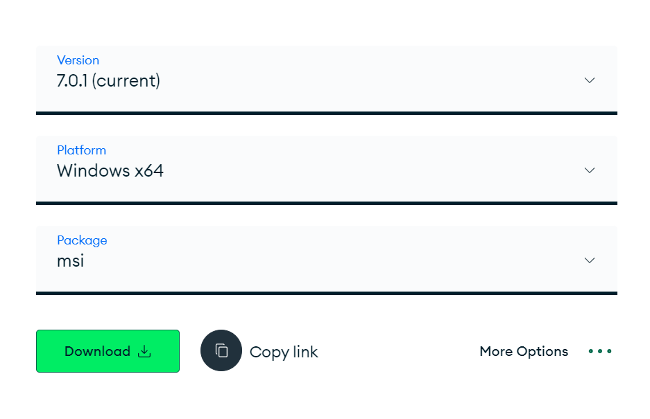
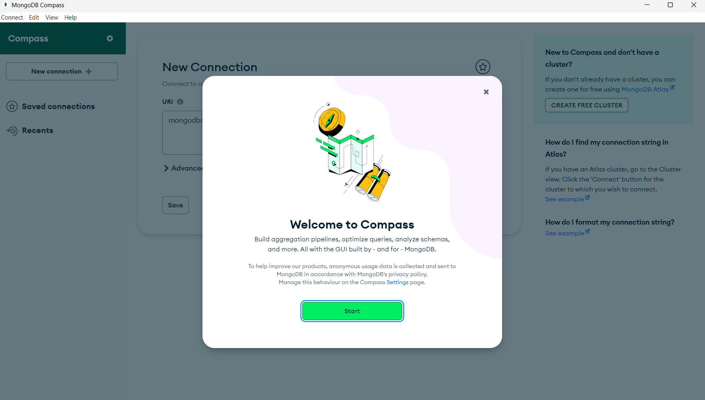
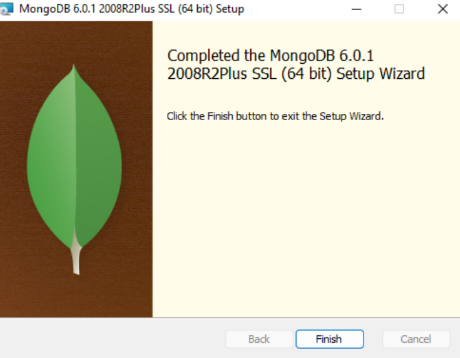
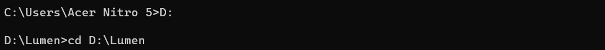
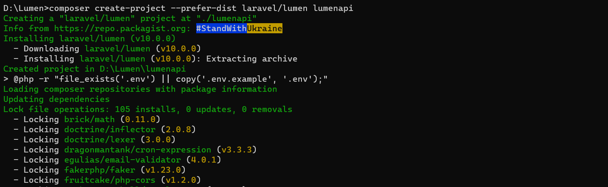
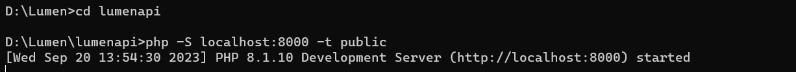
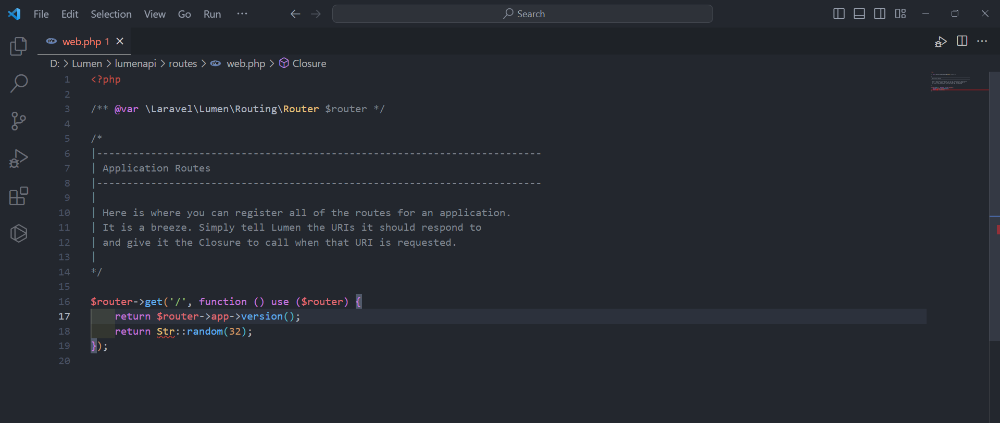
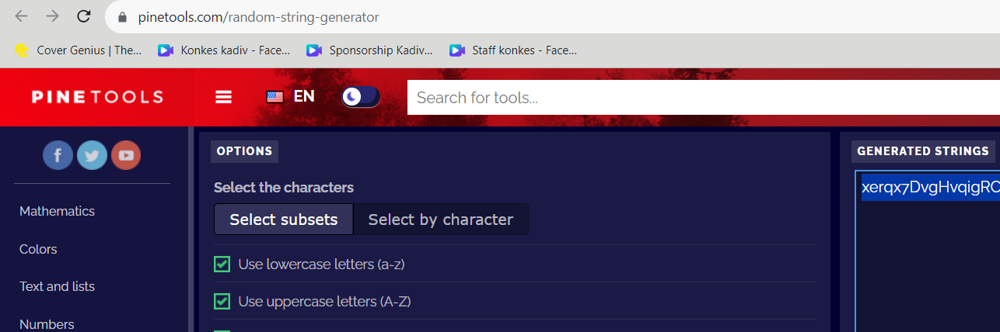
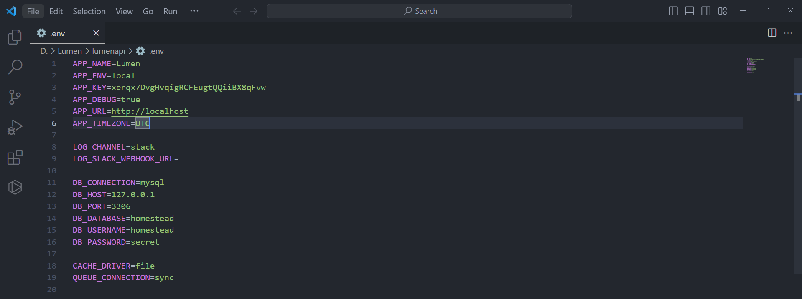

# Modul 1 Instalasi Lumen, MongoDB dan Konfigurasi APP Key

## Dasar Teori
## Lumen
<p align="justify">Lumen adalah solusi sempurna untuk membangun microservice berbasis Laravel dan API yang sangat cepat. Lumen merupakan salah satu kerangka kerja mikro tercepat yang tersedia. Pada lumen tidak perlu banyak melibatkan frontend framework JS, namun lebih difokuskan ke backend pakai php dan API. Pada penggunaan API bisa juga menggunakan laravel tapi sangat disarankan untuk tidak memakai Laravel kalau hanya untuk kebutuhan API saja karena Laravel mempunyai banyak fitur, yang nantinya fitur-fitur ini tidak terpakai karena hanya memanfaatkan API nya saja.</p>

## MongoDB
<p align="justify">MongoDB adalah database NoSQL berorientasi dokumen (document-oriented) yang menyimpan datanya dalam bentuk collection dan document Cara kerja MongoDB tidak seperti database relasional (SQL) yang bergantung pada tabel dan kolom. Hal ini memungkinkan setiap data pada MongoDB memiliki skema yang berbeda-beda.</p>

## Langkah Percobaan
1. Percobaan instalasi Composer <br><br>
   a. Buka halaman https://getcomposer.org/download/ <br><br>
   b. Download dan jalankan Composer-Setup.exe<br><br>

2. Percobaan instalasi MongoDB <br><br>
   a. Buka halaman https://www.mongodb.com/try/download/community dan klik Download <br>
    <br><br>
   b. Jalankan mongodb-windows-x86_64-6.0.1-signed.msi <br><br>
   c. Pada welcome screen klik Next <br><br>
   d. Pada bagian End-User License Agreement centang “I accept the terms in the License Agreement” dan klik Next <br><br>
   e. Pada bagian Choose Setup Type klik Complete <br><br>
   f. Pada bagian Service Configuration tanpa mengubah apapun klik Next <br><br>
   g. Pastikan “Install MongoDB Compass” tercentang <br><br>
   h. Pada langkah terakhir klik Install <br><br>
   i. Tunggu hingga tahap instalasi selesai <br><br>
   j. MongoDB Compass akan terbuka secara otomatis <br><br>
    <br><br>
   k. Klik Finish untuk menutup dialog instalasi <br><br>
    <br><br>

3. Percobaan instalasi Lumen <br>
   a. Buka folder yang diinginkan pada file explorer <br><br>
   b. Copy path dari folder yang diinginkan <br><br>
   c. Buka cmd <br><br>
   d. Buka path pada cmd <br><br>
    <br><br>
Untuk membuka path pada cmd kita dapat menjalankan command berikut pada cmd,
```
G: # Pindah storage jika folder yang dituju berada pada storage yang berbeda dengan pada saat CMD dibuka
```
```
cd G:\My Drive\College\5th Semester\Pemrograman Integratif # menggunakan command cd untuk mengganti directory kita sekarang
```
```
pwd # jalankan command pwd untuk mengecek apakah kita sudah berada di folder yang kita tuju /g/My Drive/College/5th Semester/Pemrograman Integratif
```
<br><br>
   e. Jalankan command untuk menginstall lumen pada folder tersebutSebelum menjalankan projek lumen kita, kita perlu membuka folder projek kita pada cmd dengan menggunakan command cd lumenapi <br><br>
    <br>
   ```
   composer create-project --prefer-dist laravel/lumen lumenapi
   ```
   <br><br>
   f. Buka folder projek lumen kita dan jalankan projek kita <br><br>
    <br>

# Konfigurasi APP_KEY <br>
a. Buka file web.php pada folder routes, kemudian buat endpoint yang akan mengembalikan random string dengan panjang 32 <br><br>
 <br>
```
$router->get('/key', function () {
return Str::random(32);
});
```
<br><br>
b. Melakukan generate dari website https://pinetools.com/random-string-generator<br><br>
 <br><br>

Setelah mendapat random string kita akan memasukkan random string tersebut ke file .env kita pada bagian APP_KEY <br><br>
 <br><br>
```
APP_KEY=<<random_string>>
```
