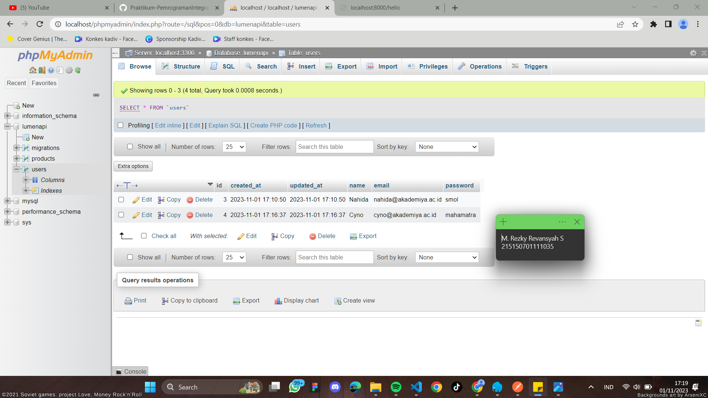

# Model, Controller dan Request-Response Handler
## Tujuan 
Setelah mengikuti praktikum ini, mahasiswa diharapkan dapat:
1. Mengimplementasikan model
2. Mengimplementasikan controller
3. Mengimplementasikan request handler
4. Mengimplementasikan response handler

## Dasar Teori 
### Model 
Model merupakan bagian yang bertugas untuk menyiapkan, mengatur, memanipulasi, 
dan mengorganisasikan data yang ada di database. Model merepresentasikan kolom 
apa saja yang ada pada databas, termasuk relasi dan primary key dapat didefinisikan 
di dalam model. Dengan menggunakan perintah Artisan, pembuatan model pada Laravel dapat 
dilakukan dengan satu perintah menggunakan
```
php artisan make:model nama_model
```
Namun karena perintah Artisan yang terbatas pada Lumen, pembuatan model harus
dilakukan secara manual.

### Controller 
Controller merupakan bagian yang menjadi tempat berkumpulnya logika pemrograman
yang digunakan untuk memisahkan organisasi data pada database. Dalam beberapa
kasus, controller menjadi penghubung antara model dan view pada arsitektur MVC

### Request Handler
Request handler adalah fungsi yang digunakan untuk berinteraksi dengan request yang
datang. Request handler dapat digunakan untuk melihat apa saja yang dikirimkan oleh
user seperti parameter, query, dan body.

### Response Handler
Response handler adalah fungsi yang digunakan untuk membentuk output yang
diharapkan kepada user dan beberapa properti selain data seperti status code dan
header.

## Langkah Percobaan 
### Model 
1. Pastikan terdapat tabel users yang dibuat menggunakan migration pada bab sebelumnya. Berikut informasi kolom yang harus ada : 
<table>
 	<tr>
 		<td> id </td>
 	</tr>
 	<tr>
 		<td> createdAt </td>
 	</tr>
  <tr>
 		<td> updateAt </td>
 	</tr>
  <tr>
 		<td> name </td>
 	</tr>
  <tr>
 		<td> email </td>
 	</tr>
 </table>
2. Bersihkan isi User.php yang ada sebelumnya dan isi dengan baris kode berikut : 

```
<?php
namespace App\Models;
use Illuminate\Database\Eloquent\Model;
class User extends Model
{
  /**
  * The attributes that are mass assignable.
  *
  * @var array
  */
  protected $fillable = [
    'name', 'email', 'password'
];
  /**
  * The attributes excluded from the model's JSON form.
  *
  * @var array
  */
  protected $hidden = [];
}
```
 <br><br>
### Controller 
1. Buatlah salinan ExampleController.php pada folder app/Http/Controllers dengan nama HomeController.php dan buatlah fungsi index() yang berisi :
```
<?php
namespace App\Http\Controllers;
class HomeController extends Controller
{
  /**
  * Create a new controller instance.
  *
  * @return void
  */
  public function __construct()
  {
  //
  }
  // Pembuatan fungsi index() //
  public function index()
  {
    return 'Hello, from lumen!';
  }
  // Pembuatan fungsi index() //
  //
}
```
 <br><br>
2. Ubah route / pada file routes/web.php menjadi seperti ini :
```
# Sebelum,
$router->get('/', function () use ($router) {
  return $router->app->version();
});

# Setelah,
$router->get('/', ['uses' => 'HomeController@index']);
```
 <br><br>
3. Jalankan aplikasi
 <br><br>
### Request Handler
1. Lakukan import library Request dengan menambahkan baris berikut di bagian atas file
```
<?php
namespace App\Http\Controllers;

// Import Library Request
use Illuminate\Http\Request;
```
 <br><br>
2. Ubah fungsi index menjadi : 
```
<?php
namespace App\Http\Controllers;
use Illuminate\Http\Request;
class HomeController extends Controller
{
  /**
  * Create a new controller instance.
  *
  * @return void
  */
  public function __construct()
  {
  //
  }
  // Perubahan fungsi index
  public function index (Request $request)
  {
  return 'Hello, from lumen! We got your request from endpoint: ' . $request->path();
  }
  // Perubahan fungsi index
  //
}
```
 <br><br>
3. Jalankan aplikasi
 <br><br>
### Response Handler
1. Lakukan import library Response dengan menambahkan baris berikut di bagian atas file
```
<?php
namespace App\Http\Controllers;

use Illuminate\Http\Request;
use Illuminate\Http\Response; // import library Response
```
 <br><br>
2. Buatlah fungsi hello() yang berisi
```
<?php
namespace App\Http\Controllers;

use Illuminate\Http\Request;
use Illuminate\Http\Response;
class HomeController extends Controller
{
  /**
  * Create a new controller instance.
  *
  * @return void
  */
  public function __construct()
  {
  //
  }
  public function index (Request $request)
  {
  return 'Hello, from lumen! We got your request from endpoint: ' . $request->path();
  }
  //
  // Pembuatan fungsi hello
  public function hello()
  {
  $data['status'] = 'Success';
  $data['message'] = 'Hello, from lumen!';
  return (new Response($data, 201))
      ->header('Content-Type', 'application/json');
  }
}
```
 <br><br>
3. Tambahkan route /hello pada file routes/web.php
```
<?php
$router->get('/', ['uses' => 'HomeController@index']);
$router->get('/hello', ['uses' => 'HomeController@hello']); // route hello
```
 <br><br>
4. Jalankan aplikasi pada route /hello
 <br><br>
### Penerapan 
1. Lakukan import model User dengan menambahkan baris berikut di bagian atas file
```
<?php
namespace App\Http\Controllers;

use App\Models\User; // import model User
use Illuminate\Http\Request;
use Illuminate\Http\Response;
```
 <br><br>
2. Tambahkan ketiga fungsi berikut di HomeController.php
```
<?php
namespace App\Http\Controllers;

use App\Models\User; // import model User
use Illuminate\Http\Request;
use Illuminate\Http\Response;

class HomeController extends Controller
{
  ...
  // Tiga Fungsi
  public function defaultUser()
  {
      $user = User::create([
          'name' => 'Nahida',
          'email' => 'nahida@akademiya.ac.id',
          'password' => 'smol'
        ]);
      return response()->json([
        'status' => 'Success',
        'message' => 'default user created',
        'data' => [
            'user' => $user,
        ]
    ],200);
}

public function createUser(Request $request)
  {
      $name = $request->name;
      $email = $request->email;
      $password = $request->password;
  
      $user = User::create([
          'name' => $name,
          'email' => $email,
          'password' => $password
      ]);
  
      return response()->json([
          'status' => 'Success',
          'message' => 'new user created',
          'data' => [
              'user' => $user,
          ]
        ],200);
  }

public function getUsers()
  {
      $users = User::all();
  
      return response()->json([
        'status' => 'Success',
        'message' => 'all users grabbed',
        'data' => [
            'users' => $users,
        ]
    ],200);
  }
// Tiga Fungsi
}
```
 <br><br>
 <br><br>
3. Tambahkan ketiga route pada file routes/web.php menggunakan group route
```
$router->get('/', ['uses' => 'HomeController@index']);
$router->get('/hello', ['uses' => 'HomeController@hello']);
// Tiga Route
$router->group(['prefix' => 'users'], function () use ($router) {
    $router->post('/default', ['uses' => 'HomeController@defaultUser']);
    $router->post('/new', ['uses' => 'HomeController@createUser']);
    $router->get('/all', ['uses' => 'HomeController@getUsers']);
});
```
 <br><br>
4. Jalankan aplikasi pada route /users/default menggunakan Postman
 <br><br>
5. Jalankan aplikasi pada route /users/new dengan mengisi body sebagai berikut
<table>
 	<tr>
 		<td> name </td>
 		<td> Cyno </td>
 	</tr>
 	<tr>
 		<td> email </td>
 		<td> cyno@akademiya.ac.id </td>
 	</tr>
  <tr>
 		<td> password </td>
 		<td> mahamatra </td>
 	</tr>
 </table>
 
  <br><br>
6. Jalankan aplikasi pada route /users/all
 <br><br>
 <br><br>
